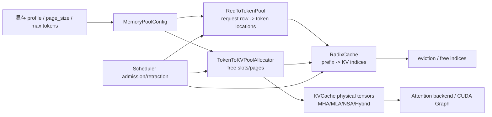

# 池化与资源管理专题

- 文档目的：追踪 SGLang 从 token 容量计算到 KV/Mamba 物理 buffer、前缀缓存、调度回收和清空的完整资源链。
- 适用范围：当前 checkout `78be4b50af88e9ea72d75b4c3a3e42b7297d2501`，普通 Engine 主线及其 MHA/MLA/Mamba、paged、Radix/HiCache 扩展边界。
- 对应源码版本：分支 `deepseek_v4_0511_mhc` / `78be4b50af`。
- 证据状态：静态源码已确认；GPU 显存峰值、CUDA Graph capture、跨进程传输和多卡运行未验证。
- 最后更新：2026-09-14
- 前置阅读：[M04 Scheduler](../01-modules/M04-scheduler-batching/README.md)、[M08 KV Cache](../01-modules/M08-kv-cache/README.md)
- 后续阅读：[M09 Attention/CUDA Graph](../01-modules/M09-attention-cuda-graph/README.md)、[M13 HiCache](../01-modules/M13-disaggregation-hicache/README.md)

## 结论摘要

SGLang 的“池”至少分三层，必须分开分析：

1. `ReqToTokenPool` 只保存请求 row 到 token location 的 int32 映射；
2. `TokenToKVPoolAllocator`/`PagedTokenToKVPoolAllocator` 只管理可分配的 slot/page 索引；
3. `MHATokenToKVPool`、`MLATokenToKVPool`、`HybridLinearKVPool` 和 `MambaPool` 才真正持有 GPU tensor。

`RadixCache` 不拥有独立的 KV 数据副本，而是把已有 slot 索引挂在 radix node 上，并用 `lock_ref` 将仍被请求使用的节点从可淘汰集合中保护起来。请求完成、未完成分块、retraction 和 eviction 都必须同时更新 request row、allocator free list、radix node 引用和物理 cache。[source/sglang/python/sglang/srt/mem_cache/memory_pool.py:129-194] [source/sglang/python/sglang/srt/mem_cache/allocator.py:35-170] [source/sglang/python/sglang/srt/mem_cache/radix_cache.py:438-630]

## 三层池模型

箭头含义：`CFG→ROW/IDX/PHY` 是初始化和容量投影；`ROW/IDX→RAD` 是索引所有权传递；`RAD→EVICT` 是缓存淘汰时归还 slot；`PHY→ATT` 是 attention 读取物理 buffer。Radix node 保存的是索引 tensor，不是另一份 K/V。[source/sglang/python/sglang/srt/model_executor/model_runner_kv_cache_mixin.py:199-270] [source/sglang/python/sglang/srt/managers/scheduler.py:785-870]

## 1. 请求 row 池

构造 `ReqToTokenPool(size, max_context_len, ...)` 时分配 `(size + 1, max_context_len)` 的 int32 device tensor，row 0 专门承接 CUDA Graph padded batch 的 dummy request index；真实 free slot 从 1 开始。[source/sglang/python/sglang/srt/mem_cache/memory_pool.py:129-153]

`alloc(reqs)` 对已有 `req_pool_idx` 的 chunked/已提交 KV 请求复用原 row，只从 `free_slots` 为新请求取 row；如果所需 row 超过容量直接返回 `None`。`free(req)` 把 row 放回列表并清空 `req_pool_idx`，但不会清零整行 token 映射，调用方必须以新的有效长度覆盖读取范围。[source/sglang/python/sglang/srt/mem_cache/memory_pool.py:161-193]

这是一种“索引池”而不是对象池：row 的拥有者是 scheduler 中的 `Req`，底层 tensor 的拥有者是 pool；chunked prefill 复用 row 的前提是请求仍持有 committed KV，否则断言失败。[source/sglang/python/sglang/srt/mem_cache/memory_pool.py:164-185]

## 2. slot/page allocator

### 普通 slot allocator

`TokenToKVPoolAllocator` 用 device tensor `free_pages` 保存 slot 编号 1..`size`，page_size 固定为 1。`alloc(n)` 从头切片，`free(indices)` 在普通模式直接拼回 free tensor；分离部署的 `need_sort` 模式先放进 `release_pages`，容量不足时再合并排序，避免异步释放顺序破坏 paged 分配的预期。[source/sglang/python/sglang/srt/mem_cache/allocator.py:121-170]

### paged allocator

`PagedTokenToKVPoolAllocator` 将 `size` 除以 `page_size` 得到 page 数。`alloc(n)` 要求 debug 模式下 n page-aligned，从 free page 编号生成连续的 `page * page_size + offset` slot index；`alloc_extend/alloc_decode` 进一步处理 prefix 已命中、最后 partial page 和新 page 的映射。[source/sglang/python/sglang/srt/mem_cache/allocator.py:362-430]

### 批量释放协议

`free_group_begin/end` 把多个请求的释放延迟到批次边界，再一次性 `free(torch.cat(...))`；这避免在同一调度更新中反复拼接 free tensor。任何新 allocator 必须保持 `available_size = free + release` 与 `clear/backup_state/restore_state` 的一致性。[source/sglang/python/sglang/srt/mem_cache/allocator.py:65-92]

## 3. 物理 KV/Mamba pool

### MHA/MLA/NSA

`KVCache` 记录 `size/page_size/dtype/layer_num/start_layer/end_layer`，对 FP8 将存储 dtype 改成 uint8，并在初始化时可挂接 memory-saver region、NVLink custom memory pool 和 layer transfer counter。[source/sglang/python/sglang/srt/mem_cache/memory_pool.py:703-742]

`MHATokenToKVPool._create_buffers` 为每层分别创建 K/V tensor，shape 为 `(size + page_size, head_num, head_dim)`；额外的 page padding 与 row 0 padding 一起保证 dummy/paged 访问不越界。`set_kv_buffer` 将模型输出按目标 dtype/量化布局写入这些固定地址，attention 通过 `get_key/value_buffer` 借用 view。[source/sglang/python/sglang/srt/mem_cache/memory_pool.py:799-857] [source/sglang/python/sglang/srt/mem_cache/memory_pool.py:906-930] [source/sglang/python/sglang/srt/mem_cache/memory_pool.py:1028-1095]

`MLATokenToKVPool` 将每层 KV 合并为 `(size + page_size, 1, kv_cache_dim)`；NSA 还拥有 page-indexed `index_k_with_scale_buffer`，该 buffer 必须与 KV 一起 offload/restore，否则 slot 复用后 index/scale 会指向别的请求。[source/sglang/python/sglang/srt/mem_cache/memory_pool.py:1517-1600] [source/sglang/python/sglang/srt/mem_cache/memory_pool.py:1880-1960]

### Mamba/Hybrid

`MambaPool` 为每个 Mamba layer 分配 `[num_layers, size + 1, ...]` 的 conv/temporal state；若启用 speculative，还额外分配 draft token 的 intermediate SSM 和 conv window cache。分配时清零选中的 index，释放时把 index tensor 拼回 `free_slots`；`fork_from` 是“分配一个新 state + 拷贝旧 state”的显式分支。[source/sglang/python/sglang/srt/mem_cache/memory_pool.py:196-384]

`HybridReqToTokenPool` 把 request row 与 Mamba index 一对一映射；`alloc` 若请求已有 `mamba_pool_idx` 则复用，否则从 MambaPool 分配，并可为 overlap schedule 分配 1/2 个 ping-pong buffer。`free_mamba_cache` 必须按保留的 track index 精确释放，不能把仍被下一次异步传输使用的 buffer 一并归还。[source/sglang/python/sglang/srt/mem_cache/memory_pool.py:485-695]

## 4. 容量计算与 allocator 选择

ModelRunner 先 profile 可用显存，再把用户 `max_total_tokens`、PP rank 的最小容量和 `max_running_requests` 约束应用到 `MemoryPoolConfig`；Mamba 模型还以 cache ratio 限制并发 request 数。[source/sglang/python/sglang/srt/model_executor/model_runner_kv_cache_mixin.py:751-801] [source/sglang/python/sglang/srt/model_executor/model_runner_kv_cache_mixin.py:803-840]

初始化 allocator 时：out-of-tree 平台使用平台 paged allocator；SWA 使用双 allocator；HiSparse 使用 host-to-device ratio；`page_size==1` 选普通 slot allocator，其他 page size 选 paged allocator。draft worker 不重复拥有 DSV4 c4/c128/state pool，而是复用 target 的尺寸/映射。[source/sglang/python/sglang/srt/model_executor/model_runner_kv_cache_mixin.py:614-720] [source/sglang/python/sglang/srt/model_executor/model_runner_kv_cache_mixin.py:772-801]

## 5. RadixCache 的索引所有权

`RadixCache` 构造时只保存两个外部池引用：`req_to_token_pool` 和 `token_to_kv_pool_allocator`。eviction policy 选择 LRU/LFU/FIFO/MRU/FILO/priority/SLRU，树节点自身通过 `lock_ref` 和 `evictable_leaves` 表示保护/可淘汰状态。[source/sglang/python/sglang/srt/mem_cache/radix_cache.py:269-318]

### 完成请求

`cache_finished_req` 读取 request row 中已提交的 KV indices，构造 page-aligned `RadixKey` 并插入树。Radix cache 接管一份引用后，重复 prefix、未对齐 tail 和未插入区间都通过 allocator.free 归还；最后对原 node `dec_lock_ref`。[source/sglang/python/sglang/srt/mem_cache/radix_cache.py:438-480]

### 未完成/分块请求

`cache_unfinished_req` 插入当前 fill ids 后重新 match，把树中 canonical indices 写回 request row，并更新 `cache_protected_len`、`prefix_indices` 和 node lock。page_size>1 的 partial page 可能仍在 request 工作集而不在树节点中，必须留到下一次 cache/完成路径再释放。[source/sglang/python/sglang/srt/mem_cache/radix_cache.py:485-537]

### 淘汰与保护

`evict(num_tokens)` 只从无 child 且 `lock_ref==0` 的 leaf heap 中选节点，先把 node.value 归还 allocator，再删除树节点；父节点在无 child 且未锁定时重新进入候选堆。`inc_lock_ref/dec_lock_ref` 沿祖先链同步 `evictable_size_` 与 `protected_size_`。[source/sglang/python/sglang/srt/mem_cache/radix_cache.py:558-630]

## 6. 调度中的资源闭环

Scheduler 初始化先从 TP worker 取得两个池，再按 multimodal/transformers、SWA/SSM、disaggregation 和 chunked prefill 选择 Radix、Chunk、HiRadix、Mamba 或 Unified cache。某些组合（例如 decode disaggregation + SWA/SSM Radix）主动抛出 ValueError，因为 allocator/layout 契约不兼容。[source/sglang/python/sglang/srt/managers/scheduler.py:785-870]

Prefill admission 同时受 `max_running_requests`、request row 可用数和 KV allocator 可用 token 数限制；chunked request 释放 row 后必须允许重新加入，否则会把仍需写回的 KV 误判为泄漏。[source/sglang/python/sglang/srt/managers/scheduler.py:2577-2735]

Decode 内存不足时，`update_running_batch` 记录 allocator/Mamba pool 可用量，调用 `batch.retract_decode`，再用释放前后差值计算回收 token 数并对无法恢复的请求发送 abort。这个差值是诊断 ownership 是否闭合的重要观测点。[source/sglang/python/sglang/srt/managers/scheduler.py:2869-2920]

Engine idle 时 `flush_cache` 才允许 reset radix tree、清空 request pool 和 KV allocator，并可额外调用 `empty_device_cache`；非 idle 状态不会强制清空，避免正在运行的 batch 访问已释放的 tensor。[source/sglang/python/sglang/srt/managers/scheduler.py:3402-3420]

## 7. CUDA Graph 与自定义 memory pool 边界

KV pool 的固定 tensor 地址、row 0 padding 和 graph runner 的 static buffer registry 是互相依赖的：graph replay 只能把 live batch 写入预先分配的 row/slot view；动态 metadata 和不满足 shape/后端约束的 batch 必须回退 eager。`KVCache` 还可能在 `torch.cuda.use_mem_pool(custom_mem_pool)` 区域创建 buffer，不能把 custom pool 的生命周期误当成 Python pool 对象生命周期。[source/sglang/python/sglang/srt/mem_cache/memory_pool.py:739-742] [source/sglang/python/sglang/srt/mem_cache/memory_pool.py:906-930] [source/sglang/python/sglang/srt/model_executor/model_runner_kv_cache_mixin.py:614-720]

详细 graph eligibility/capture 仍见 [M09 文档](../01-modules/M09-attention-cuda-graph/README.md)；当前仅静态确认，未宣称任意 GPU 配置都能 capture/replay。

`CudaGraphRunner` 不是只保存一个 `CUDAGraph` 句柄：初始化时先根据 TP/CP、speculative、LoRA 和最大 batch 计算 capture batch 集合，创建固定形状的 `DecodeInputBuffers`，随后在 `model_capture_mode()` 中捕获；`can_run()` 对动态 embedding 等输入直接返回 false，调用方必须走 eager fallback。全局 graph memory pool 通过 `set_global_graph_memory_pool`/`get_global_graph_memory_pool` 复用，但 graph key 仍按 batch/stream/variant 区分（[source/sglang/python/sglang/srt/model_executor/cuda_graph_runner.py:547-570,573-721,757-760]）。

KV cache 的 `maybe_init_custom_mem_pool` 是另一条 allocator context：它在 KV tensor 创建阶段可能启用 `torch.cuda.use_mem_pool(custom_mem_pool)`，而不是在每次 slot/page alloc 时切换 pool。因而 reset/flush 必须同时考虑 KV tensor backing、graph static input buffers 和 pynccl/custom pool；只清 Radix tree 或只调用 `empty_cache` 都不足以证明显存已归还（[source/sglang/python/sglang/srt/mem_cache/memory_pool.py:703-742]）。

## 资源所有权表

| 对象 | 实际 owner | 借用者 | 释放/归还点 | 主要风险 |
|---|---|---|---|---|
| request row | `ReqToTokenPool` | `Req`、ForwardBatch | `ReqToTokenPool.free/clear` | 旧 row 映射残留 |
| KV slot/page index | allocator free/release tensor | Req、Radix node、host backup | `free`、evict、flush | double free/漏 free |
| K/V physical tensor | KVCache/ModelRunner | attention backend、copy/offload | pool 对象/flush | stream 未同步、地址失效 |
| Radix node value | RadixCache 引用索引 | cache/request | `evict`、finished/unfinished cleanup | lock_ref 不配对 |
| Mamba state/ping-pong | MambaPool/HybridReqToTokenPool | request、layer transfer | `free_mamba_cache`/clear | 异步传输中的提前回收 |
| CUDA custom memory pool | device allocator context | KV tensor 创建路径 | allocator/device teardown | Python 对象仍在但 backing pool 已销毁 |
| CUDA Graph static buffers | `CudaGraphRunner`/`DecodeInputBuffers` | graph replay/eager fallback | runner teardown、pool reset | capture batch/shape/LoRA variant 不匹配 |

## 失败路径与测试建议

| 场景 | 静态行为 | 推荐验证 |
|---|---|---|
| request row 不足 | `ReqToTokenPool.alloc` 返回 None，admission 停止 | 多 request/复用 row 单测 |
| KV slot/page 不足 | allocator 返回 None，scheduler 触发 retraction/abort | tiny pool + decode retract |
| page 未对齐 | debug allocator assert；prefix tail 延迟释放 | page_size 64 + partial page |
| radix prefix 重复 | 插入返回 prefix_len，重复 indices 立即 free | prefix collision/eviction |
| Mamba pool 不足 | `HybridReqToTokenPool.alloc` assert 并给出 ratio 建议 | speculative/overlap buffer 压力 |
| backend/layout 不兼容 | scheduler 初始化显式 ValueError | SWA/SSM/disaggregation 组合矩阵 |
| flush 非 idle | 不执行清空 | 正在运行请求期间调用 flush 的拒绝测试 |
| CUDA Graph 不满足条件 | 回退 eager，而不是释放 pool | graph eligibility/fallback smoke |
| graph pool/backing reset | 全局 graph pool 与 KV custom pool 分离清理 | capture→replay→flush→runner teardown 显存快照 |

源码测试入口包括 `python/sglang/test/attention/` 的 pool/backend fixture、`test/srt/cpu/test_decode.py` 的 request-to-token 读取，以及 radix/memory pool 相关单测；本轮未执行 GPU/多卡测试。

## 风险与取舍

| 风险/取舍 | 影响 | 控制方法 |
|---|---|---|
| 三层池状态不同步 | attention 读错 slot、UAF 或显存泄漏 | 每条 retraction/eviction 更新 row、allocator、tree 三者并做差值断言 |
| page 对齐造成尾部驻留 | 可用 token 少于表面容量 | 记录 `cache_protected_len`，单独统计 partial page |
| allocator 通过 tensor 拼接维护 free list | 大批量释放可能产生临时分配和碎片 | 使用 free group；必要时 benchmark sort/merge 频率 |
| Radix lock_ref 遗漏 | 节点永不淘汰或提前释放 | 复核 inc/dec 对称性和 abort/finish 双路径 |
| graph/static address 约束 | 动态 batch 不能 replay | 保留 eager fallback，不把 graph eligibility 当作正确性保证 |
| 代表性 pool 不能覆盖专用变体 | HiSparse/Unified/HiCache/NSA 可能有额外 ownership | 文档按变体列出，运行环境具备后逐项测试 |

## 相关文档

- [M08 KV Cache](../01-modules/M08-kv-cache/README.md)
- [M09 Attention 与 CUDA Graph](../01-modules/M09-attention-cuda-graph/README.md)
- [M13 分离部署与 HiCache](../01-modules/M13-disaggregation-hicache/README.md)
- [跨模块共享数据](shared-data-and-types.md)
- [性能关键路径](performance-critical-paths.md)

## 源码证据摘要

请求池：[source/sglang/python/sglang/srt/mem_cache/memory_pool.py:129-194]；Mamba/物理 KV：[source/sglang/python/sglang/srt/mem_cache/memory_pool.py:196-384,703-930]；allocator：[source/sglang/python/sglang/srt/mem_cache/allocator.py:35-170,362-430]；Radix：[source/sglang/python/sglang/srt/mem_cache/radix_cache.py:269-318,438-630]；scheduler wiring：[source/sglang/python/sglang/srt/managers/scheduler.py:785-870,2577-2735,2869-2920,3402-3420]。

## 未解决问题

- 当前 checkout 下所有专用 allocator（SWA、HiSparse、Unified、NPU/out-of-tree）的完整跨池调用链仍需逐一补齐。
- GPU 显存 profile 与实际 allocator 峰值、custom memory pool backing 和 graph capture 的运行时结果未测量。
- HiCache L2/L3、RDMA、offload/restore 的异步完成与 slot 复用顺序需要硬件/网络环境验证。

## 下一步阅读建议

先读本页三层池模型，再沿 `ModelRunner._init_pools` → `Scheduler.init_cache_with_memory_pool` → `RadixCache.cache_finished_req` 追踪一个请求从分配到释放。
