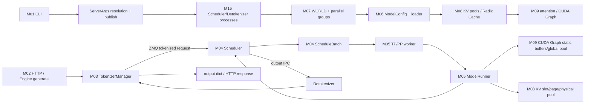

# 跨模块系统 wiring

- 文档目的：把 SGLang 的启动、请求、执行和返回链路放在同一张运行时地图中。
- 适用范围：M01-M18（普通 HTTP LLM 主线及 speculative、multimodal、disaggregation、MoE/LoRA、设备、Rust/router 变体）。
- 对应源码版本：`78be4b50af88e9ea72d75b4c3a3e42b7297d2501`
- 证据状态：部分完成
- 最后更新：2026-09-10
- 前置阅读：[总体架构](../00-overview/architecture.md)、[D01 离线 Engine](../80-demos/D01-offline-engine/01-离线批量推理.md)
- 后续阅读：[运行轨迹](runtime-trace.md)、[修改影响图](change-impact-map.md)

## 结论摘要

**已确认**：普通离线 Engine 的运行时 wiring 由两条方向组成。启动方向把 `ServerArgs` 解析结果发布到 tokenizer/scheduler 角色，并建立进程、端口、WORLD、模型和 KV/attention 资源；请求方向把 `GenerateReqInput` 经过 TokenizerManager 和 IPC 送入 Scheduler，再由 worker/ModelRunner 执行并把 `BatchStrOutput` 返回到请求状态。[`python/sglang/srt/entrypoints/engine.py:1051-1260`][`python/sglang/srt/managers/tokenizer_manager.py:776-845`][`python/sglang/srt/managers/scheduler.py:1839-1925`]

## 总体 wiring

图中箭头含义：CLI→CFG 是配置调用；CFG→PROC 是生命周期创建；M03→S 和 S→DET 是序列化消息；S→W→R 是进程内或 worker 内执行调用；M03→OUT 是本地状态通知；R→GP/KP 是 replay/static buffer 与 KV pool 的资源依赖。节点均有源码证据，具体变体（Ray、disaggregation、diffusion）未在此图展开。

## 系统串联矩阵

| 阶段 | 模块 | 入口符号 | 输入 | 状态变化 | 上下文 | 副作用 |
|---|---|---|---|---|---|---|
| 配置 | M01 | `Engine._launch_subprocesses` | `ServerArgs` | resolve/publish | 主进程 | 建立运行时配置投影 |
| 进程 | M15 | `_launch_scheduler_processes` | `PortArgs`、rank 参数 | child process/pipe | 主进程→子进程 | 启动 scheduler |
| 分布式 | M07 | `init_torch_distributed` | tp/pp/parallel config | WORLD/groups | scheduler worker | 建立通信组 |
| 模型 | M06/M05 | `TpModelWorker`、`ModelRunner.load_model` | ModelConfig/LoadConfig | 参数、runner | worker/device | 访问 checkpoint/GPU |
| 请求 | M03 | `generate_request` | `GenerateReqInput` | `rid_to_state` | asyncio 主进程 | tokenize/IPC |
| 调度 | M04 | `event_loop_normal` | IPC request | waiting/running/batch | scheduler process | admission/KV/批次 |
| 计算 | M05 | `forward_batch_generation` | `ScheduleBatch` | logits/next ids | worker/device | forward/sample |
| 返回 | M03/M15 | `handle_loop` | `BatchStrOutput` | `ReqState`/out list | asyncio 主进程 | 通知调用者 |

## 边界分类

- **编译依赖**：Python 包发现 Rust 扩展；不是请求运行时调用。[`python/setup.py`]
- **静态源码依赖**：模块 import、继承和字段类型引用。
- **运行时调用**：`Engine.generate → generate_request → _send_one_request`。
- **消息关系**：TokenizerManager 与 Scheduler/Detokenizer 通过 socket 对象传输。
- **数据关系**：`rid`、`TokenizedGenerateReqInput`、`Req`、`ScheduleBatch` 和 `BatchStrOutput` 在边界间转换。
- **生命周期关系**：Engine 负责 child process；scheduler 负责 worker/model/KV；TokenizerManager 负责本地 request state。

## 相关文档

- [跨模块接口契约](interface-contracts.md)
- [M15 多进程与 IPC 控制面](../01-modules/M15-ipc-control-plane/README.md)
- [统一运行轨迹](runtime-trace.md)
- [端到端流程](end-to-end-flows.md)
- [配置影响图](configuration-impact-map.md)

## 源码证据摘要

- [`python/sglang/srt/entrypoints/engine.py:1051-1260`](../../source/sglang/python/sglang/srt/entrypoints/engine.py)
- [`python/sglang/srt/managers/tokenizer_manager.py:776-845`](../../source/sglang/python/sglang/srt/managers/tokenizer_manager.py)
- [`python/sglang/srt/managers/scheduler.py:1839-1925`](../../source/sglang/python/sglang/srt/managers/scheduler.py)
- [`python/sglang/srt/managers/tp_worker.py:1-564`](../../source/sglang/python/sglang/srt/managers/tp_worker.py)

## 未解决问题

不同 event loop、DP routing、disaggregation 和 Ray deployment 会改变 wiring；需要分别建立运行轨迹，不能把本图当成所有部署模式的完整实现。

## 下一步阅读建议

从 [M03 Tokenizer 与请求状态](../01-modules/M03-tokenizer-request-state/README.md) 到 [M04 调度](../02-request-flow/03-调度器与连续批处理.md)，再回到本图检查每条跨边界数据。
